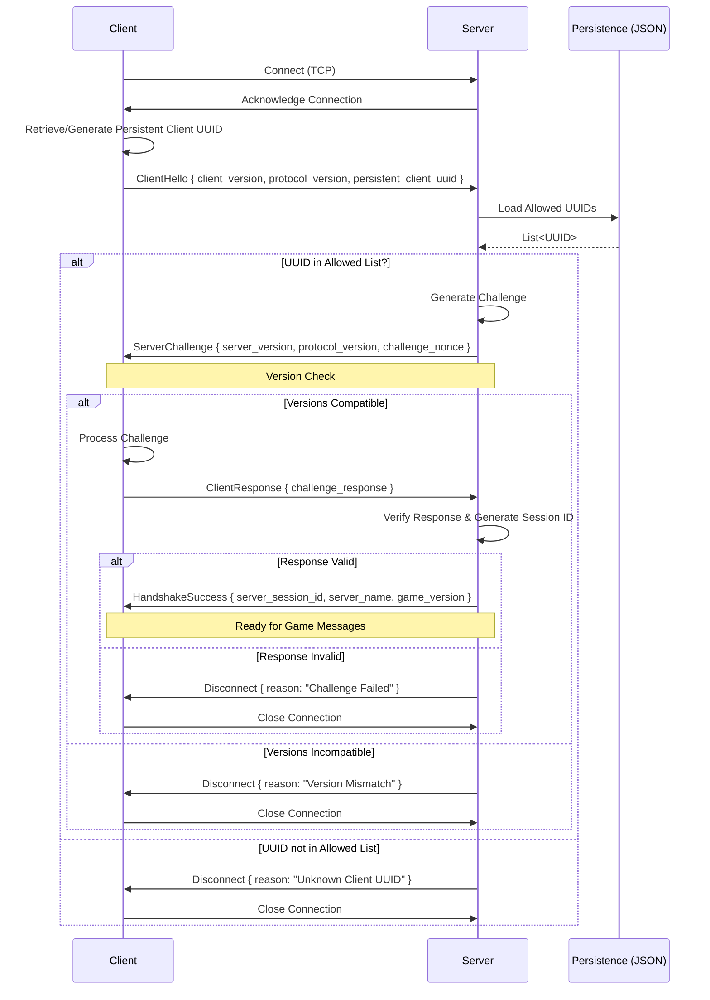
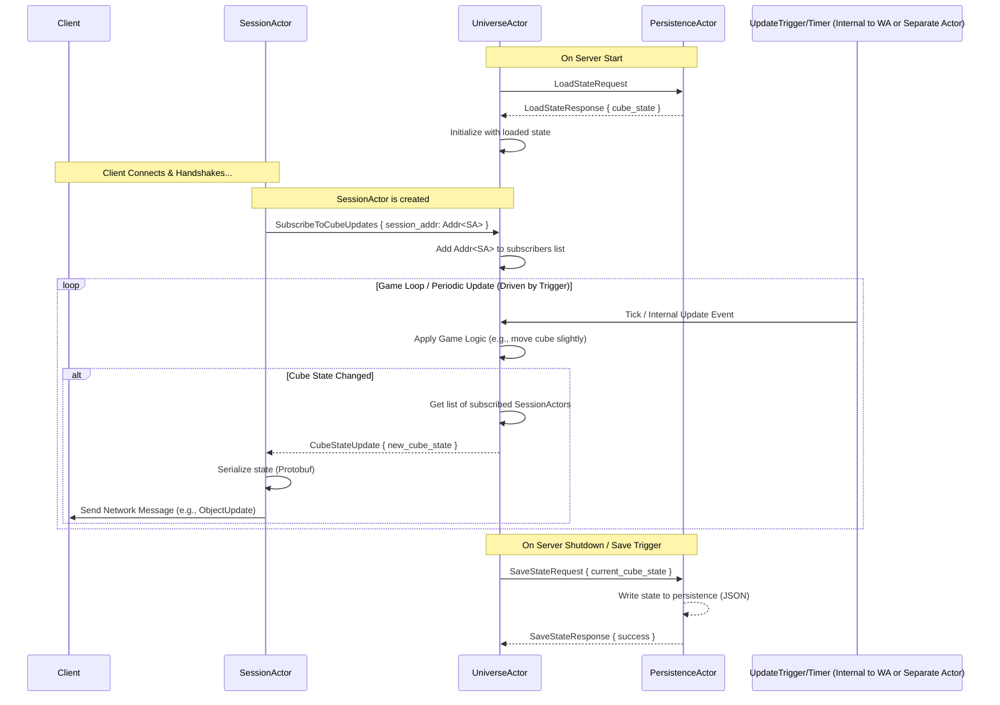

# VoidArchitect Documentation

## Handshake Protocol (Option D: Combined + Simple UUID Allow List Check)

This protocol outlines the initial steps taken when a client connects to the server, incorporating version checking, a basic UUID allow-list check via JSON persistence, a simple challenge-response, and server-assigned session ID generation.

### Flow

1.  **Connect & Hello:** Client connects, retrieves/generates its **persistent UUID**, and sends `ClientHello` (with versions and this UUID).
2.  **UUID Check:** Server receives `ClientHello`.
3.  Server uses the `PersistenceSystem` (JSON backend) to load a list of allowed UUIDs from a file (e.g., `allowed_clients.json`).
4.  **UUID Check:**
    *   If the client's UUID is **not** in the allowed list, the server sends `Disconnect` (Reason: "Unknown Client UUID") and closes the connection.
    *   If the client's UUID **is** in the allowed list, the handshake proceeds:
5.  **Challenge-Response & Version Check:**
    *   Server sends `ServerChallenge` (with server versions, random nonce).
    *   Client verifies server versions. If incompatible, disconnects.
    *   Client processes the nonce and sends `ClientResponse`.
    *   Server verifies the response. If invalid, sends `Disconnect` (Reason: "Challenge Failed").
6.  **Success:**
    *   If the response is valid, the server generates a unique **server-assigned session ID**.
    *   Server sends `HandshakeSuccess` (with session ID, server info).
    *   Handshake complete.

### Diagram



### Pros

*   Implements the requested simple UUID allow-list check using JSON.
*   Provides basic filtering of unknown clients.
*   Retains version checking, server-assigned session IDs, and a structure suitable for future authentication.

### Cons & Caveats

*   **Security:** This is **not secure authentication**. It relies on a non-secret UUID and only filters unknown clients. It does *not* prevent malicious actors with a known UUID.
*   **Client Persistence:** Requires the client to reliably store and reuse its UUID.
*   **Management:** Needs manual management of the allowed UUID list in JSON.
*   **Performance:** JSON I/O per connection might become slow if the list grows very large, but is likely acceptable for initial development.

## Engine Server Architecture: Session Management (Chosen Approach: Actor Model with Actix)

This section details the chosen architecture for handling client sessions and core server logic within the `engine_server` crate, based on the **Actor Model** using the **Actix** framework. This approach was selected over the initially considered Task-per-Session model due to its anticipated benefits in managing complexity, scalability within a single node, and integrating with background simulation tasks and future multi-node distribution mechanisms (like RPC and MQ).

### Core Concepts (Actix)

1.  **Actors:** Independent, stateful units of computation (e.g., `SessionActor`, `WorldRegionActor`). They communicate exclusively via messages and do not share state directly.
2.  **Messages:** Data structures defining the interactions between actors (e.g., `ClientToServerMsg`, `UpdateWorldState`, `GetPlayerInfo`).
3.  **Addresses (`Addr`):** Handles used to send messages to actors without needing direct references, enabling loose coupling.
4.  **Context (`Context<Self>`):** Provided to actors during message handling, allowing them to interact with the Actix system (e.g., get their own address, stop themselves, spawn futures).
5.  **Handlers:** Actors implement `Handler<M>` traits to define how they react to specific message types `M`.

### Architectural Flow (Conceptual)

1.  **Network Listening & Handoff:**
    *   A main Tokio task initializes the Actix `System` and starts a `NetworkListenerActor`.
    *   `NetworkListenerActor` listens for incoming TCP connections.
    *   Upon connection, it might spawn a temporary `HandshakeActor` responsible for the authentication protocol (as described in the Handshake Protocol section).
    *   If the handshake succeeds, the `HandshakeActor` sends a message (e.g., `RegisterSession { stream, client_info }`) to a central `SessionManagerActor`.
    *   **Rationale:** Decouples network I/O and handshake logic into dedicated actors.

2.  **Session Management:**
    *   The `SessionManagerActor` receives the `RegisterSession` message.
    *   It starts a new `SessionActor`, potentially passing the `TcpStream` (or a framed codec) and client details to it. It registers the new `SessionActor`'s address (`Addr<SessionActor>`).
    *   The `SessionActor` takes ownership of the client connection, handling reads/writes, processing client messages, and managing player-specific state. It runs within the Actix `System`, scheduled efficiently onto underlying Tokio tasks/threads.
    *   **Rationale:** Encapsulates all logic and state for a single player session within one actor. Leverages Actix scheduling for potentially better resource usage than one Tokio task per session at scale.

3.  **Inter-Actor Communication:**
    *   `SessionActor` communicates with other parts of the system (e.g., `UniverseActor`, `PersistenceActor`) by sending messages to their respective addresses (`Addr`).
    *   **Request/Response:** Actor A sends a message to Actor B including its own address (`ctx.address()`). Actor B processes the message and sends a reply message back to Actor A's address.
    *   **Broadcasts/Events:** Mechanisms like `actix-broker` or custom event actors can be used to publish events (e.g., world changes, global announcements) that multiple actors can subscribe to.
    *   **Rationale:** Enforces clear, message-based communication, avoids shared mutable state, and fits naturally with both session logic and background simulation updates.

### Diagram: Actor-Based Interaction (Conceptual)

```mermaid
graph TD
    subgraph Network Handling
        A[TCP Listener Task] --> B(NetworkListenerActor);
        B -- Connection --> C{Spawn HandshakeActor};
        C -- Handshake OK --> D[Msg: RegisterSession];
    end

    subgraph Session Management
        E(SessionManagerActor) --> F{Start SessionActor};
        F --> G[SessionActor 1];
        F --> H[SessionActor N];
    end

    subgraph Core Systems (Actors)
        J[World Actor];
        K[Persistence Actor];
        L[...];
        M[EventBrokerActor]
    end

    D -- Addr<SessionManagerActor> --> E;

    G -- Addr<UniverseActor> --> J;
    H -- Addr<PersistenceActor> --> K;
    J -- Addr<SessionActor> --> G; // Reply or direct message
    J -- Addr<EventBrokerActor> --> M; // Publish world event

    M -- Subscribed --> G; // Receive relevant events
    M -- Subscribed --> H;

    style G fill:#eaf,stroke:#333,stroke-width:2px
    style H fill:#eaf,stroke:#333,stroke-width:2px
    style B fill:#fea,stroke:#333,stroke-width:1px
    style C fill:#fea,stroke:#333,stroke-width:1px
    style E fill:#adf,stroke:#333,stroke-width:1px
    style J fill:#adf,stroke:#333,stroke-width:1px
    style K fill:#adf,stroke:#333,stroke-width:1px
    style M fill:#adf,stroke:#333,stroke-width:1px

```

### Scalability & Distribution Notes

*   **Single Node:** The Actor Model with Actix is expected to handle ~1k sessions more efficiently than Task-per-Session by managing scheduling onto a limited thread pool.
*   **Multi-Node (Future):** Distribution across multiple machines will require integrating external mechanisms like:
    *   **RPC (e.g., gRPC/Tonic):** For direct request/response between services/actors on different nodes.
    *   **Message Queue (e.g., NATS):** For broadcasting events or queuing tasks across nodes.
    *   Actors will interact with these distribution layers via dedicated client libraries or wrapper actors. Actix itself does not provide transparent clustering.

## Milestone 3 Architecture Details: Persistent Mobile Cube

This section details the specific actors and interactions required within the Actix framework to implement Milestone 3: a single, server-authoritative, persistent cube object whose state is synchronized to connected clients.

### Core Actors for Milestone 3

Building upon the general Actix architecture:

*   **`NetworkListenerActor`**: (As above) Listens for connections, spawns `HandshakeActor`.
*   **`HandshakeActor`**: (As above) Handles handshake, tells `SessionManagerActor` to create a session on success.
*   **`SessionManagerActor`**: (As above) Creates and tracks `SessionActor` instances.
*   **`SessionActor`**: (As above) Manages a single client connection.
    *   **M3 Specifics:** Subscribes to state updates for the cube from the `UniverseActor` (or via an event bus). Receives `CubeStateUpdate` messages and serializes/sends them to the client using Protobuf (e.g., as an `ObjectUpdate` message). May receive client input messages in the future, but likely not needed for M3's server-driven cube.
*   **`UniverseActor`**: The authoritative owner of the game state.
    *   **M3 Specifics:** Manages the state (e.g., `position: Vec3`, `rotation: Quat`, `color: Color`) of the single persistent cube object. Holds this data directly within its state.
    *   **Responsibilities:**
        *   Loads initial cube state from `PersistenceActor` on startup.
        *   Processes messages that modify the cube's state (e.g., `MoveCube`, `SetCubeColor` - potentially triggered internally by an update timer for M3).
        *   Contains the core update logic (e.g., applying movement over time if the cube is meant to move automatically).
        *   Notifies relevant `SessionActor`s about state changes (see Notification Mechanism).
        *   Sends `SaveStateRequest` to `PersistenceActor` periodically or on shutdown.
        *   Manages subscriptions from `SessionActor`s interested in cube updates.
*   **`PersistenceActor`**: Handles saving and loading game state.
    *   **M3 Specifics:** Responsible for persisting the `UniverseActor`'s state (specifically, the cube's data) using the configured backend (e.g., JSON file via `serde`). Handles `LoadStateRequest` and `SaveStateRequest` messages from the `UniverseActor`.
*   **`UpdateTriggerActor` / Internal Timer**: (Optional, depends on M3 requirements) If the cube's state needs to change automatically over time (e.g., continuous movement), a mechanism is needed.
    *   **Option A:** A dedicated `UpdateTriggerActor` sends a `Tick` message to the `UniverseActor` at a fixed interval (e.g., using `actix::clock::interval`).
    *   **Option B:** The `UniverseActor` itself spawns an interval future within its `started` method or `Context` (`ctx.run_interval`) to send `Tick` messages to itself. (Option B is likely simpler for M3).
*   **Notification Mechanism**: How the `UniverseActor` informs `SessionActor`s about state changes.
    *   **Option A (Direct Messaging):** `UniverseActor` maintains a `HashSet<Addr<SessionActor>>` of subscribers. When the cube state changes, it iterates through the set and sends a `CubeStateUpdate` message directly to each address. `SessionActor` sends a `SubscribeToCubeUpdates` message on creation. Simple for one object.
    *   **Option B (Event Broker):** Use a dedicated `EventBrokerActor` (e.g., using `actix-broker`). `UniverseActor` publishes a `CubeStateUpdated` event. `SessionActor`s subscribe to this event type. More scalable for many event types/sources but adds another actor. (Option A is likely sufficient for M3).

### Diagram: Milestone 3 Interaction Flow (Single Cube Update)



### Implementation Notes

*   Define Protobuf messages for client-server communication regarding object state (e.g., `ObjectUpdate`, potentially containing position, rotation, etc.).
*   Define Actix messages for inter-actor communication (e.g., `LoadStateRequest`, `SaveStateRequest`, `SubscribeToCubeUpdates`, `CubeStateUpdate`, `Tick`).
*   Implement the state structures for the cube within the `UniverseActor`.
*   Implement the persistence logic within the `PersistenceActor` using `serde_json` or the chosen backend.
*   Implement the network serialization/deserialization logic within the `SessionActor`.
