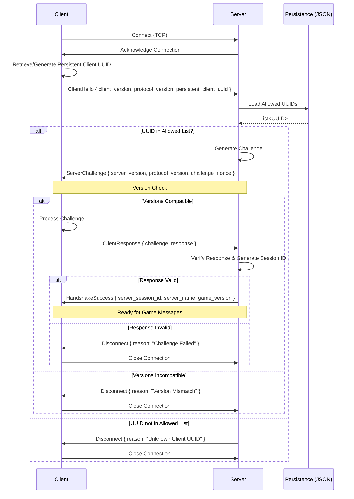

# VoidArchitect Documentation

## Handshake Protocol (Option D: Combined + Simple UUID Allow List Check)

This protocol outlines the initial steps taken when a client connects to the server, incorporating version checking, a basic UUID allow-list check via JSON persistence, a simple challenge-response, and server-assigned session ID generation.

### Flow

1.  **Connect & Hello:** Client connects, retrieves/generates its **persistent UUID**, and sends `ClientHello` (with versions and this UUID).
2.  **UUID Check:** Server receives `ClientHello`.
3.  Server uses the `PersistenceSystem` (JSON backend) to load a list of allowed UUIDs from a file (e.g., `allowed_clients.json`).
4.  **UUID Check:**
    *   If the client's UUID is **not** in the allowed list, the server sends `Disconnect` (Reason: "Unknown Client UUID") and closes the connection.
    *   If the client's UUID **is** in the allowed list, the handshake proceeds:
5.  **Challenge-Response & Version Check:**
    *   Server sends `ServerChallenge` (with server versions, random nonce).
    *   Client verifies server versions. If incompatible, disconnects.
    *   Client processes the nonce and sends `ClientResponse`.
    *   Server verifies the response. If invalid, sends `Disconnect` (Reason: "Challenge Failed").
6.  **Success:**
    *   If the response is valid, the server generates a unique **server-assigned session ID**.
    *   Server sends `HandshakeSuccess` (with session ID, server info).
    *   Handshake complete.

### Diagram

### Pros

*   Implements the requested simple UUID allow-list check using JSON.
*   Provides basic filtering of unknown clients.
*   Retains version checking, server-assigned session IDs, and a structure suitable for future authentication.

### Cons & Caveats

*   **Security:** This is **not secure authentication**. It relies on a non-secret UUID and only filters unknown clients. It does *not* prevent malicious actors with a known UUID.
*   **Client Persistence:** Requires the client to reliably store and reuse its UUID.
*   **Management:** Needs manual management of the allowed UUID list in JSON.
*   **Performance:** JSON I/O per connection might become slow if the list grows very large, but is likely acceptable for initial development.